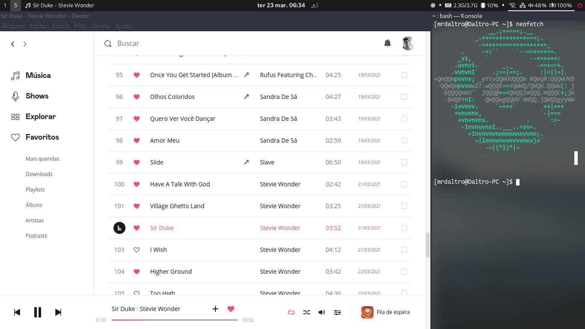

# Deezer for Void Linux



Just another of that scripts that ports unsupported software to our free OS paradise. Based on the [script for Ubuntu made by siphomateke](https://github.com/siphomateke/deezer) and, of course, on [the original PKGBUILD made by SibrenVasse](https://aur.archlinux.org/packages/deezer/).

Just like those two scripts, this one uses the available setup made by Deezer for Windows, by extracting the sources of the Electron bundled software, patching for better Linux compatibility and, finally, by packaging it again and installing on the system.

## Installing process

To install on Void:

```bash
git clone https://github.com/daltroaugusto/deezer-void
cd deezer-void
chmod +x ./install.sh
./install.sh
```

Then, you'll be promped to input your root password and the script will make all the job (check/install dependencies, rebuild node_modules), and everything in a *clean* way: after the building process, the working directory will be automatically cleaned, unless you use the `--noclean` parameter on `install.sh` script. All the process is divided in steps that are already based on the standard [xbps-src](https://github.com/void-linux/void-packages/) routines. The idea for a near future is to package it all in an authentic Void package, or even in Flatpak, with some help of [electron-packager](https://github.com/electron/electron-packager).

### Additional options
There are patches, made by @SibrenVasse, that brings two features: hide menu bar and enable *minimize to tray* function. In this script, by default (and personal choice of someone that uses tiling wm and don't relies that much on software that wasn't packaged for our OS), both patches are disabled. But you can easily enable any of these patches just using parameters beside `./install sh`:
```bash
./install.sh [--nomenu] [--minimizetotray]
```
Don't worry on the parameter's order. Just as said in the previous section, there are a `--noclean` parameter as well, just for the case you want to deal with built junk after the (re)building process.


### Uninstall
With these scripts, you can easily uninstall Deezer by running `uninstall.sh` script. 

### Update
You can easily update the script directly, just changing Electron and Deezer version parameters (as well as SHA256 for the Deezer's setup file). If you don't feel safe doing that, you can always get updated just running **the same** 

## Debugging

Running the application from the command line will show verbose logging.

```bash
deezer
```

To run the application with devtools by running

```bash
env DZ_DEVTOOLS=yes electron /usr/share/deezer/app.asar
```

To debug node, you can extract the source files to a directory and inspect the node process by attaching using the chromium debugging tools. (<https://www.electronjs.org/docs/tutorial/debugging-main-process>)

```bash
asar extract /usr/share/deezer/app.asar $dest
electron --inspect-brk=$port $dest
```
## Issues
For some strange (and unknown, for me) reason(s), I was unable to enable *dark mode*, at least in my i3wm-only environment. I'd appreciate if someone could test this feature in some desktop environment. Additional debugging (and patching?) may be required.


<div align="right"><small>Proudly written with help of <a href="https://github.com/benweet/stackedit">StackEdit</a>.</small></div>
